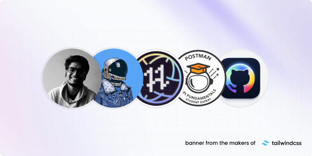

<picture>
  <source srcset="./hero/2xl-1536px.png" media="(min-width: 1280px)" />
  <source srcset="./hero/xl-1280px.png" media="(min-width: 1024px)" />
  <source srcset="./hero/lg-1024px.png" media="(min-width: 768px)" />
  <source srcset="./hero/md-768px.png" media="(min-width: 640px)" />
  
</picture>

### AshishK is mad!
😎 I know I've over-used that line but let me use it this one more time! 
👋 Hello fellas! 
😉 My name is Ashish Khare and I love to live on the dirty side of the web planet, aka the javascript tooling world. 
🍃 I center my life around topics like VDOM, notion data typing, and of course tailwind.  
👀 Recently, I started building libraries like Avvvatars. Soon I'll tell you more.  
🐦 I mostly stay awake at [Twitter Inc.](https://twitter.com/AshishK1331)  

My current tech stack includes:
- Javascript, Python
- Next.js/Vite.js + Framer Motion
- Zustand
- Tailwind CSS
- Supabase/Firebase
- React Testing Library
- ShadCN UI/ Radix UI

👟 Well, I know a lot of things and learning more. So, follow me to be a part of my journey.
